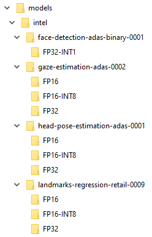

# Computer-Pointer-Controller
Control your mouse pointer with your eyes

## Description

This project use the [Gaze Estimation model](https://docs.openvinotoolkit.org/latest/_models_intel_gaze_estimation_adas_0002_description_gaze_estimation_adas_0002.html) to estimate the gaze of the user's eyes and change the mouse pointer position accordingly.

It runs multiple models in the same machine and coordinate the flow of data between those models.


## Prerequisites

You need OpenCV and Intel's OpenVino toolkit installed on your machine.

* [OpenCV](https://opencv.org) - The simple install should look like `pip install opencv-python`.
* [OpenVino toolKit](https://software.intel.com/en-us/openvino-toolkit) - See website for installation depending of your configuration.

### Models download

With the help of the OpenVino toolkit, you'll have to download the 4 models used in this project.
The default values in the code suppose you execute these commands from the "model" directory.

You'll end up with a directory structure like this :



But you are of course free to use any compatible model, and specify these with the corresponding parameters.

#### Windows syntax example

This will download the models in all precisions available. You can add a ```--precisions``` argument if you only want a specific precision.
These example are for the default installation of OpenVino 2020.2.117
```
python "C:\Program Files (x86)\IntelSWTools\openvino\deployment_tools\tools\model_downloader\downloader.py" --name face-detection-adas-binary-0001
python "C:\Program Files (x86)\IntelSWTools\openvino\deployment_tools\tools\model_downloader\downloader.py" --name head-pose-estimation-adas-0001
python "C:\Program Files (x86)\IntelSWTools\openvino\deployment_tools\tools\model_downloader\downloader.py" --name landmarks-regression-retail-0009
python "C:\Program Files (x86)\IntelSWTools\openvino\deployment_tools\tools\model_downloader\downloader.py" --name gaze-estimation-adas-0002
``` 

The total files size is about 41MB.

## Demo

A basic usage should be as simple as this command :
```python main.py```

Without any parameters, the script will run in webcam mode and will try to use models in the expected directories.

Here is an example of the script in action with a webcam (default) :
[resources/example.mp4](resources/example.mp4)

See below to specify other parameters.

## Documentation

With command line arguments, you can specify other models or precisions (FP32 is used by default).

There is 4 parameters corresponding to the 4 models used :
- ```--face_detection_model```
- ```--gaze_estimation_model```
- ```--head_pose_estimation_model```
- ```--facial_landmarks_detection_model```

You have to give the model's name, without the .bin or .xml extensions.

Another important argument is the ```--input_type``` argument. It can takes 3 values : ```cam``` (default), ```video``` or ```image```.
With the 2 last values, you'll have to specify another argument ```--input_file``` that points to the appropriate file.

The script also provides a ```--device``` argument (default='CPU') that allows the script to use different hardware to execute the inference ("GPU", "MYRIAD", ...), as provided by the OpenVino framework.
The ```--extensions``` argument allows the script to make use of OpenVino extension.

There is a ```--show_face``` argument (default='True') that allow you to disable the display of the detected face in a window.

Finally, for performance analysis, there is a ```--perf_counts``` argument (default='False') that display on the terminal a lot of statistics about inferences performance for each model used.

## Benchmarks

On a Windows 10 PC with an old i5-6500 CPU, I measured the following performances :

- CPU & FP32 precisions : loading time = 686ms / Average total inferences time: 13ms
- CPU & FP16 precisions : loading time = 685ms / Average total inferences time: 13ms
- CPU & INT8 precisions : loading time = 850ms / Average total inferences time: 12ms

- GPU & FP32 precisions : loading time = 51.0s / Average total inferences time: 25ms
- GPU & FP16 precisions : loading time = 52.5s / Average total inferences time: 25ms
- GPU & INT8 precisions : loading time = 54.5s / Average total inferences time: 26ms

- CPU + MYRIAD on Gaze Estimation & FP16 : loading time = 2s / Average total inferences time: 17ms
- CPU + MYRIAD on Facial Landmarks Detection & FP16 : loading time = 2s / Average total inferences time: 17ms
- CPU + GPU on Face Detection & FP16 : loading time = 32s / Average total inferences time: 22ms

Notes : 
- the Face Detection model is available only with a FP32-INT1 precision.
- the "Average total inferences time" is for the sum of 4 models inferences.

## Licence

These scripts are my work for the "Computer Pointer Controller" project of the Udacity "Intel® Edge AI for IoT Developers Nanodegree" Program and are based on Intel Corporation base scripts provided for the project.

They should not be used to complete your own project. Plagiarism is a violation of the Udacity Honor Code. Udacity has zero tolerance for plagiarized work submitted in any Nanodegree program.
